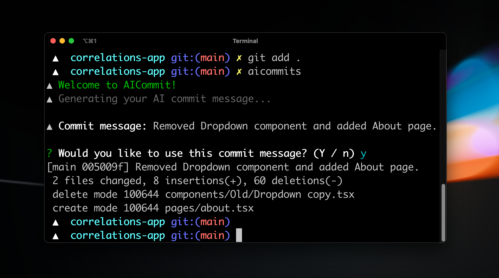

<div align="center">
  <div>
    
    
    <h1 align="center">AI Commits</h1>
  </div>
  <p>Una CLI che scrive i tuoi messaggi di commit git con l'AI. Non scrivere mai più un messaggio di commit.</p>
  <a href="https://www.npmjs.com/package/aicommits"></a>
  <a href="https://www.npmjs.com/package/aicommits"></a>
</div>

---

## Configurazione

> La versione minima supportata di Node.js è v22. Controlla la tua versione di Node.js con `node --version`.

1. Installa _aicommits_:

   ```sh
   npm install -g aicommits
   ```

2. Esegui il comando di configurazione per scegliere il tuo provider AI:

   ```sh
   aicommits setup
   ```

Questo ti guiderà attraverso:

- La selezione del tuo provider AI (imposta la configurazione `provider`)
- La configurazione della tua chiave API
- **Il recupero automatico e la selezione tra i modelli disponibili** (quando supportato)
- **La scelta del formato preferito per i messaggi di commit** (plain, conventional o gitmoji)

  I provider supportati includono:

  - **TogetherAI** (consigliato) - Ottieni la tua chiave API da [TogetherAI](https://api.together.ai/)
  - **OpenAI** - Ottieni la tua chiave API dalla [pagina delle chiavi API di OpenAI](https://platform.openai.com/account/api-keys)
  - **Groq** - Ottieni la tua chiave API dalla [Console Groq](https://console.groq.com/keys)
  - **xAI** - Ottieni la tua chiave API dalla [Console xAI](https://console.x.ai/)
  - **OpenRouter** - Ottieni la tua chiave API da [OpenRouter](https://openrouter.ai/keys)
  - **Ollama** (locale) - Esegui modelli AI localmente con [Ollama](https://ollama.ai)
  - **LM Studio** (locale) - Nessuna chiave API richiesta. Gira sul tuo computer tramite [LM Studio](https://lmstudio.ai/)
  - **Endpoint personalizzato compatibile con OpenAI** - Usa qualsiasi servizio che implementa l'API OpenAI

  **Per ambienti CI/CD**, puoi anche configurare le impostazioni tramite il file di configurazione:

  ```bash
  aicommits config set OPENAI_API_KEY="la_tua_chiave_api"
  aicommits config set OPENAI_BASE_URL="il_tuo_endpoint_api"  # Opzionale, per endpoint personalizzati
  aicommits config set OPENAI_MODEL="il_tuo_modello"          # Opzionale, predefinito al default del provider
  ```

  > **Nota:** Quando si usano variabili d'ambiente, assicurarsi che tutte le variabili correlate (es. `OPENAI_API_KEY` e `OPENAI_BASE_URL`) siano impostate in modo coerente per evitare disallineamenti con il file di configurazione.

  Questo creerà un file `.aicommits` nella tua directory home.

### Aggiornamento

Controlla la versione installata con:

```sh
aicommits --version
```

Per aggiornare all'ultima versione, esegui:

```sh
aicommits update
```

Questo rileverà automaticamente il tuo gestore di pacchetti (npm, pnpm, yarn o bun) e aggiornerà usando il comando corretto.

In alternativa, puoi aggiornare manualmente:

```sh
npm install -g aicommits
```

## Utilizzo

### Modalità CLI

Puoi chiamare `aicommits` direttamente per generare un messaggio di commit per le tue modifiche in staging:

```sh
git add <files...>
aicommits
```

`aicommits` passa i flag sconosciuti a `git commit`, quindi puoi passare i [flag di `commit`](https://git-scm.com/docs/git-commit).

Ad esempio, puoi mettere in staging tutte le modifiche nei file tracciati durante il commit:

```sh
aicommits --all # o -a
```

> 👉 **Suggerimento:** Usa l'alias `aic` se `aicommits` è troppo lungo per te.

#### Opzioni CLI

- `--all` o `-a`: Metti automaticamente in staging le modifiche nei file tracciati per il commit (predefinito: **false**)
- `--clipboard` o `-c`: Copia il messaggio selezionato negli appunti invece di eseguire il commit (predefinito: **false**)
- `--generate` o `-g`: Numero di messaggi da generare (predefinito: **1**)
- `--exclude` o `-x`: File da escludere dall'analisi AI
- `--type` o `-t`: Formato del messaggio di commit git (predefinito: **plain**). Supporta `plain`, `conventional` e `gitmoji`
- `--prompt` o `-p`: Prompt personalizzato per guidare il comportamento del LLM (es. lingua specifica, istruzioni di stile)
- `--no-verify` o `-n`: Salta gli hook pre-commit durante il commit (predefinito: **false**)
- `--yes` o `-y`: Salta la conferma al momento del commit dopo la generazione del messaggio (predefinito: **false**)

#### Generare più raccomandazioni

A volte il messaggio di commit suggerito non è il migliore, quindi potresti volerne generare alcuni tra cui scegliere. Puoi generare più messaggi di commit contemporaneamente passando il flag `--generate <i>`, dove 'i' è il numero di messaggi da generare:

```sh
aicommits --generate <i> # o -g <i>
```

> Attenzione: questo utilizza più token, il che significa costi maggiori.

#### Formati dei Messaggi di Commit

Puoi scegliere tra quattro diversi formati di messaggi di commit:

- **plain** (predefinito): Messaggi di commit semplici e non strutturati
- **conventional**: Formato [Conventional Commits](https://conventionalcommits.org/) con tipo e scope
- **gitmoji**: Messaggi di commit basati su emoji
- **subject+body**: Riga oggetto in stile Git più un corpo (descrizione) generato dal diff

Usa il flag `--type` per specificare il formato:

```sh
aicommits --type conventional # o -t conventional
aicommits --type gitmoji       # o -t gitmoji
aicommits --type plain         # o -t plain (predefinito)
aicommits --type subject+body  # o -t subject+body (oggetto + corpo)
```

Questa funzione è utile se il tuo progetto segue uno standard specifico per i messaggi di commit o se stai usando strumenti che si basano su questi formati.

#### Prompt Personalizzati

Puoi personalizzare il comportamento del LLM con il flag `--prompt` per guidare la generazione dei messaggi di commit:

```sh
# Scrivi messaggi di commit in una lingua specifica
aicommits -p "Scrivi i messaggi di commit in italiano"

# Concentrati su aspetti specifici delle modifiche
aicommits -p "Concentrati sulle implicazioni di performance delle modifiche"

# Usa uno stile o tono specifico
aicommits -p "Usa un linguaggio tecnico adatto a sviluppatori senior"

# Includi dettagli specifici nel messaggio
aicommits -p "Menziona sempre i nomi specifici delle funzioni e i percorsi dei file modificati"
```

### Hook Git

Puoi anche integrare _aicommits_ con Git tramite l'hook [`prepare-commit-msg`](https://git-scm.com/docs/githooks#_prepare_commit_msg). Questo ti permette di usare Git normalmente e di modificare il messaggio di commit prima di eseguirlo.

#### Installazione

Nel repository Git in cui vuoi installare l'hook:

```sh
aicommits hook install
```

#### Disinstallazione

Nel repository Git in cui vuoi disinstallare l'hook:

```sh
aicommits hook uninstall
```

#### Utilizzo

1. Metti in staging i tuoi file ed esegui il commit:

   ```sh
   git add <files...>
   git commit # Genera un messaggio solo quando non ne viene passato uno
   ```

   > Se vuoi scrivere il tuo messaggio invece di generarne uno, puoi semplicemente passarlo: `git commit -m "Il mio messaggio"`

2. Aicommits genererà il messaggio di commit per te e lo passerà a Git. Git lo aprirà con l'[editor configurato](https://docs.github.com/en/get-started/getting-started-with-git/associating-text-editors-with-git) per permetterti di revisionarlo/modificarlo.

3. Salva e chiudi l'editor per eseguire il commit!

### Variabili d'Ambiente

Puoi anche configurare aicommits usando variabili d'ambiente invece del file di configurazione.

**Esempio:**

```bash
export OPENAI_API_KEY="sk-..."
export OPENAI_BASE_URL="https://api.example.com"
export OPENAI_MODEL="gpt-4"
aicommits  # Usa le variabili d'ambiente
```

Le impostazioni di configurazione vengono risolte nel seguente ordine di precedenza:

1. Argomenti da riga di comando
2. Variabili d'ambiente
3. File di configurazione
4. Valori predefiniti

## Configurazione

### Visualizzazione della configurazione attuale

Per visualizzare tutte le opzioni di configurazione attuali che differiscono dai valori predefiniti, esegui:

```sh
aicommits config
```

Questo mostrerà solo i valori di configurazione non predefiniti con le chiavi API mascherate per sicurezza. Se non è impostata alcuna configurazione personalizzata, mostrerà "(utilizzo di tutti i valori predefiniti)".

### Cambiare il modello

Per selezionare o cambiare interattivamente il tuo modello AI, esegui:

```sh
aicommits model
```

Questo:

- Mostrerà il tuo provider e modello attuali
- Recupererà i modelli disponibili dall'API del tuo provider
- Ti permetterà di selezionare tra i modelli disponibili o inserire un nome di modello personalizzato
- Aggiornerà automaticamente la tua configurazione

### Aggiornamento di aicommits

Per aggiornare all'ultima versione, esegui:

```sh
aicommits update
```

Questo:

- Verificherà l'ultima versione su npm
- Rileverà il tuo gestore di pacchetti (npm, pnpm, yarn o bun)
- Aggiornerà usando il comando appropriato
- Mostrerà il progresso e confermerà al completamento

### Leggere un valore di configurazione

Per recuperare un'opzione di configurazione, usa il comando:

```sh
aicommits config get <chiave>
```

Ad esempio, per recuperare la chiave API, puoi usare:

```sh
aicommits config get OPENAI_API_KEY
```

Puoi anche recuperare più opzioni di configurazione contemporaneamente separandole con spazi:

```sh
aicommits config get OPENAI_API_KEY generate
```

### Impostare un valore di configurazione

Per impostare un'opzione di configurazione, usa il comando:

```sh
aicommits config set <chiave>=<valore>
```

Ad esempio, per impostare la chiave API, puoi usare:

```sh
aicommits config set OPENAI_API_KEY=<la-tua-chiave-api>
```

Puoi anche impostare più opzioni di configurazione contemporaneamente separandole con spazi, come

```sh
aicommits config set OPENAI_API_KEY=<la-tua-chiave-api> generate=3 locale=it
```

### Opzioni di Configurazione

#### OPENAI_API_KEY

La tua chiave API OpenAI o la chiave API del provider personalizzato

#### OPENAI_BASE_URL

URL dell'endpoint API personalizzato compatibile con OpenAI.

#### OPENAI_MODEL

Modello da usare per i provider compatibili con OpenAI.

#### provider

Il provider AI selezionato. Impostato automaticamente durante `aicommits setup`. Valori validi: `openai`, `togetherai`, `groq`, `xai`, `openrouter`, `ollama`, `lmstudio`, `custom`.

#### locale

Predefinito: `en`

La lingua da usare per i messaggi di commit generati. Consulta l'elenco dei codici su: https://wikipedia.org/wiki/List_of_ISO_639-1_codes.

#### generate

Predefinito: `1`

Il numero di messaggi di commit da generare tra cui scegliere.

Nota: questo utilizzerà più token poiché genera più risultati.

#### timeout

Il timeout per le richieste di rete all'API OpenAI in millisecondi.

Predefinito: `10000` (10 secondi)

```sh
aicommits config set timeout=20000 # 20s
```

#### max-length

La lunghezza massima in caratteri del messaggio di commit generato.

Predefinito: `72`

```sh
aicommits config set max-length=100
```

#### type

Predefinito: `plain`

Il tipo di messaggio di commit da generare. Opzioni disponibili:

- `plain`: Messaggi di commit semplici e non strutturati
- `conventional`: Formato Conventional Commits con tipo e scope
- `gitmoji`: Messaggi di commit basati su emoji

Esempi:

```sh
aicommits config set type=conventional
aicommits config set type=gitmoji
aicommits config set type=plain
```

## Come funziona

Questo strumento CLI esegue `git diff` per raccogliere tutte le ultime modifiche al codice, le invia al provider AI configurato (TogetherAI per impostazione predefinita), quindi restituisce il messaggio di commit generato dall'AI.

Video in arrivo in cui lo ricostruisco da zero per mostrarti come costruire facilmente i tuoi strumenti CLI alimentati dall'AI.

## Maintainer

- **Hassan El Mghari**: [@Nutlope](https://github.com/Nutlope) [](https://x.com/nutlope)

- **Riccardo Giorato**: [@riccardogiorato](https://github.com/riccardogiorato) [](https://x.com/riccardogiorato)

- **Hiroki Osame**: [@privatenumber](https://github.com/privatenumber) [](https://twitter.com/privatenumbr)

## Contribuire

Se vuoi aiutare a correggere un bug o implementare una funzionalità nelle [Issues](https://github.com/Nutlope/aicommits/issues), consulta la [Guida alla Contribuzione](CONTRIBUTING.md) per imparare come configurare e testare il progetto
