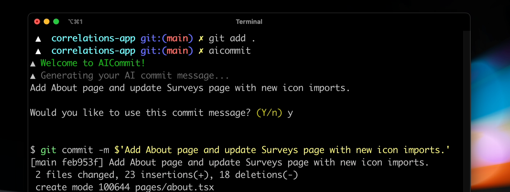

# AI Commit

Have AI Commit write your git commit messages for you so you never have to write a commit message again.

## How to install

1. Run `npm i -g zx` (this CLI uses zx)
2. Run `git clone github.com/nutlope/aicommit` in your root directory
3. Add a file called `.env.json` in the folder with your OpenAI API key. You can get this by [signing up](https://openai.com/api/)
4. [Optional] If you're on mac, add `alias aicommit="zx ~/ai-commit/aicommit.mjs"` to your `.zshrc` so you can trigger the program simply by typing `aicommit`

**Note:** The process to install this will get vastly simplified when I rewrite this CLI and publish it as an npm package to be run with `npx`.

## How it works

This project uses a command line interface tool called zx that's developed by google. In the script, it runs a `git diff` command to grab all the latest changes, sends this to OpenAI's GPT-3, then returns the AI generated commit message. Video coming soon where I rebuild it from scratch to show you how to easily build your own CLI tools powered by AI. Fully privacy friendly as commands only run on your local machine using your OpenAI account.

## Remaining tasks

- [x] Get a working first version with zx
- [ ] pwd trick to get rid of /Users/hassan from the code
- [ ] Add better error handling for missing git add . and commit msgs about a certain amount of chars
- [ ] Try openai curie And/OR codex
- [ ] Try supporting more than 200 lines by grabbing the diff per file
- [ ] Add support for conventional commits
- [ ] Rewrite this CLI tool using a Node framework and publish on npm to simplify the process
- [ ] Build landing page w/ demo
